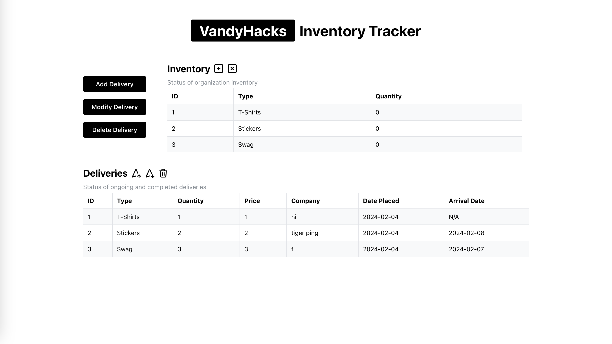
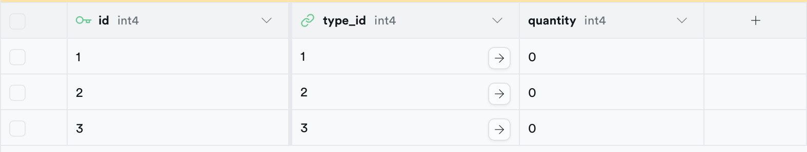
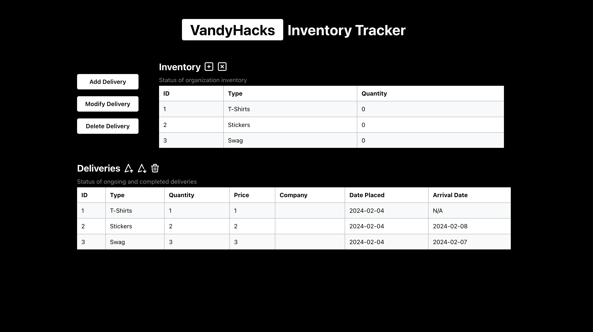

# VandyHacks Coding Assessment 2024 

## The Problem Being Solved
For this project, I chose to solve the Operations Team's problem.

**Operations:** "We have a lot of physical items to manage, such as t-shirts, stickers, and swag, but it's difficult to keep track of inventory and ensure that everything is delivered on time. If only there is an easy way to manage and track these items..."

## The App and Its Value Proposition
The app provides a streamlined and intuitive solution for managing the VandyHacks inventory. With a clean and easy-to-navigate user interface, the app simplifies the process of tracking and accessing inventory data.  

Key features include:  

**Inventory Management:** The app enables efficient management of inventory items essential for Vandyhacks events. 
**Streamlined Interface:** I designed the app with a focus on simplicity and efficiency. Users can quickly find the information they need without navigating through cluttered menus or complex interfaces, enhancing productivity.

## Demo 

The picture above is of the main page of the web app

The picture above is of one of the tables ('inventory') created (supabase)

The picture above is of the main page in dark mode

## Potential Additional Features
1. Finishing the functions (ie. adding to inventory, adding to deliveries, all the buttons)
2. The ability to add more types of physical items
3. A display with the club budget
4. More and better looking color schemes

## Run Commands
**Server side:** 'npm run dev'  
**Client side:** 'npm start'